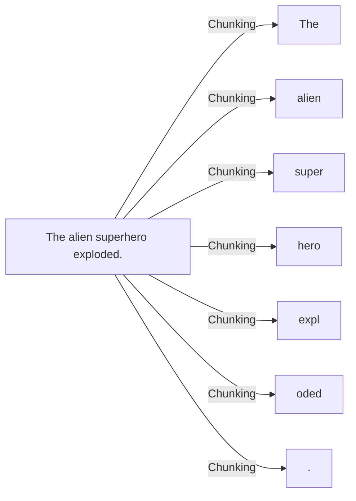
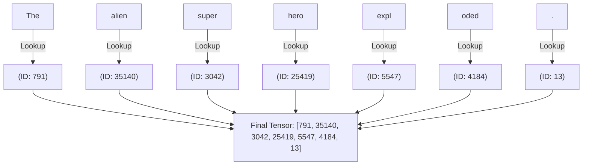

# Step 1: The Tokenizer

Before a Deep Learning model can do any math, we must convert human text into integers. This model uses OpenAI's `tiktoken` (specifically the `cl100k_base` vocabulary used in GPT-4).

## The Core Concept: Subword Tokenization

Instead of mapping every single English word to a number (which would create a dictionary of millions of words), or mapping every single character (which forces the model to learn spelling from scratch), GPT uses **Byte-Pair Encoding (BPE)**.

It breaks words down into common "chunks" (subwords).

### Visualizing the Split

If we feed the tokenizer the sentence: `"The alien superhero exploded."`

*Notice how "superhero" was split into two common chunks, and "exploded" was split into two common chunks. The leading spaces are also mathematically important parts of the chunk!*

### Translating to Integers

Once the text is chunked, the tokenizer looks up each chunk in its massive dictionary of 100,277 known pieces, and returns the matching Integer ID:

## How `step1_tokenizer.py` works

This file is essentially a translation dictionary. 
* `.encode()` takes a String and returns the List of Integers.
* `.decode()` takes a List of Integers (outputted by the model) and stitches the string chunks back together so humans can read it.

Once the integers are generated, they are passed directly into `step2_gpt.py` to be embedded!
