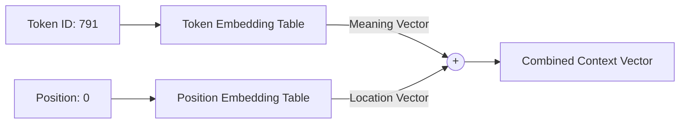
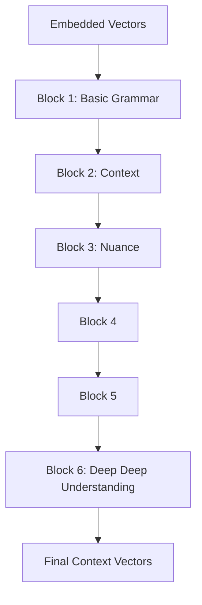

# Step 2: The Deep Learning Brain (GPT)

The `step2_gpt.py` file is the outer shell of the mathematical engine. It takes the raw integer IDs from the tokenizer and turns them into deep, contextualized vectors.

## 1. The Embedding Tables

When an integer (like `791` for "The") enters the model, it is meaningless math. GPT fixes this by immediately passing it through two lookup tables:

1. **Token Embedding:** A dictionary that stores the pure "meaning" of a word.
2. **Position Embedding:** A dictionary that stores the concept of "where" in the sentence the word sits (because Transformers read every word at the exact same time, not left-to-right).

By adding them together, the vector now means: *"I am the word 'The' and I am the first word in the sentence."*

## 2. The Transformer Blocks

Once the vectors are created, they are passed through a stack of **Transformer Blocks** (`step2a_block.py`). 

Our Nano-GPT uses 6 blocks stacked on top of each other. Each block refines the vector's understanding of the sentence further and further.

Once the vectors exit the final block, they are fully processed and ready to be turned back into English words by `step3_output.py`!
