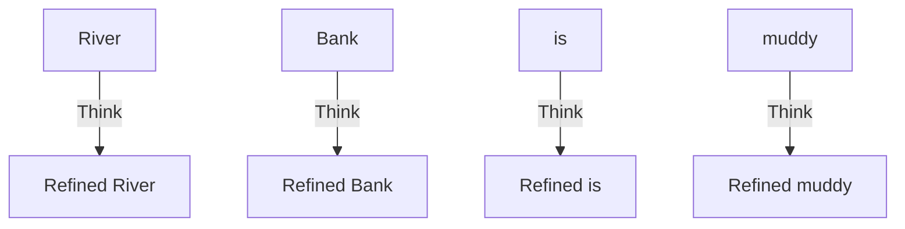

# Step 2a1: The FeedForward Layer

The `step2a1_feedforward.py` file is the pure computation organ of the Transformer. 

While the "Attention" layers allow tokens to talk to *other* tokens, the FeedForward layer physically isolates every single token and refuses to let them share information.

## The Computation Phase

Imagine the tokens have just finished talking to each other in the Attention layer. The word **" బ్యాంకు" (Bank)** just realized the word **"River"** is sitting next to it. 

"Bank" now has a huge realization: *"Oh! I am a watery bank, not a money bank!"* 

The FeedForward layer gives "Bank" time to think about this new realization in total isolation. 

*Notice how there are no arrows crossing between the words. The FeedForward layer acts independently on every single token.*

## How does it process?

The math inside FeedForward is incredibly simple. It is a classic Neural Network.

1. **Expand:** The `Embedding_Size` (e.g. 384 numbers) is blown up out to `4 * Embedding_Size` (e.g. 1536 numbers). This massive expansion gives the token enough "surface area" to map out complex patterns.
2. **Activate:** The numbers are run through a Non-Linear Activation Function (`ReLU`). Any negative numbers are crushed to 0. This gives the network the ability to understand curved, non-linear human logic.
3. **Compress:** The massive 1536 vector is shrunk back down to exactly 384 numbers. 
4. **Exit:** The newly refined 384-vector exits the FeedForward layer and goes to the next Transformer block!
