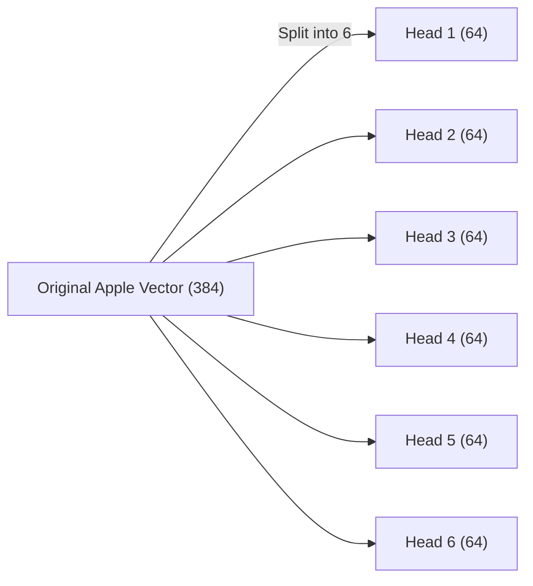
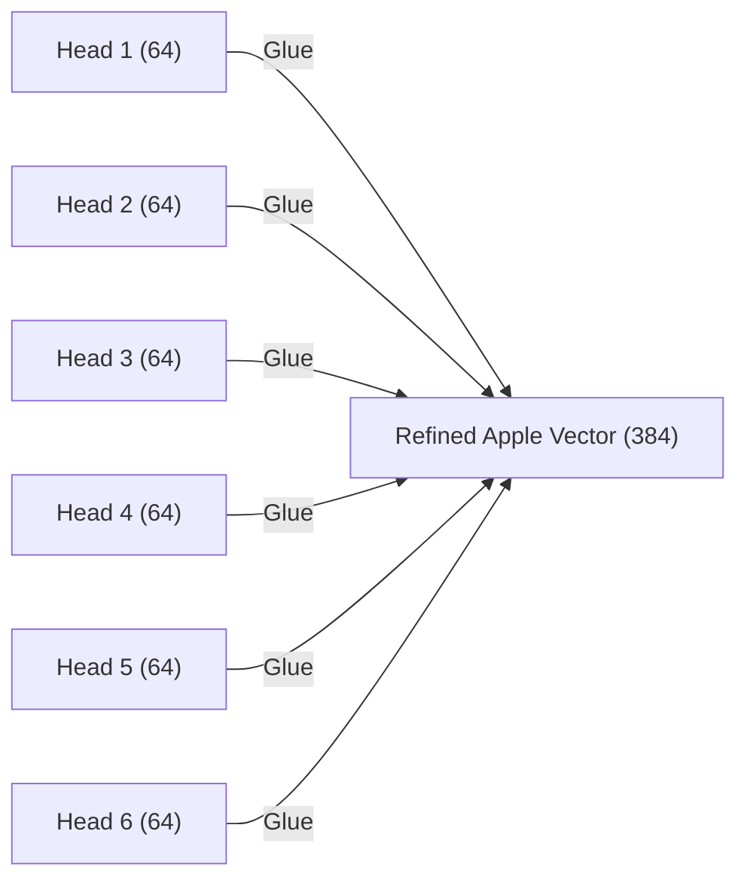

# Step 2a2: Multi-Head Attention

The `step2a2_multihead.py` file is the orchestrator. Its only job is to manage the `step2a2a_attention` workers below it.

## Why Multi-Head?

If a token like the word **"Apple"** only had 1 Attention Head to look around the sentence, it could only look for *one concept*. For example, it might look to the left to find out if it's a "Green Apple" or a "Red Apple".

But what if "Apple" also needs to know if it's the *subject* of the verb? Or if it's the *brand* Apple computer? It can't do all of that with only 1 Head!

The solution is to physically split the `Embedding_Size` (384 numbers) into many tiny, independent Heads (e.g., 6 heads that have 64 numbers each).

### Diagram: Splitting the Attention

Here is exactly how the 384-vector for "Apple" is split up across 6 parallel `step2a2a_attention.py` workers.

*   **Head 1:** Looks for Adjectives (Red, Green, Shiny)
*   **Head 2:** Looks for Verbs (Eat, Throw, Buy)
*   **Head 3:** Looks for Punctuation (Is it the end of the sentence?)
*   **Head 4:** Looks for Pronouns (Did 'He' eat it?)
*   **Head 5:** Looks for Tech Context (Is it a Mac?)
*   **Head 6:** Looks for Abstract Meaning.

### The Concatenation

Because these 6 heads run in parallel at the exact same time, the math is incredibly fast. 

Once the 6 heads finish finding their individual contextual clues, the Multi-Head Attention module `concatenates` (glues) them back together into a single 384-vector, and projects it back out!

