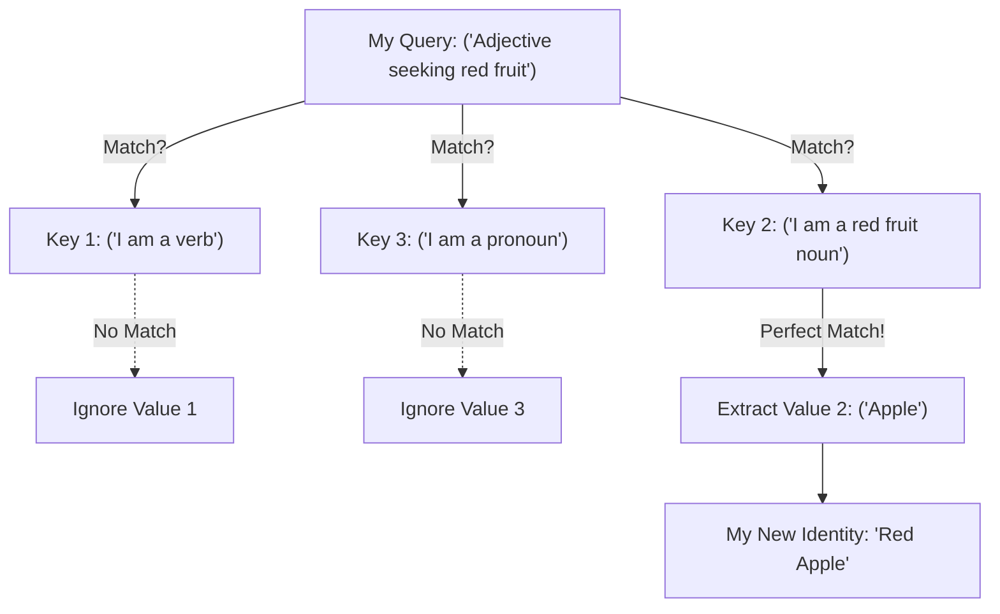

# Step 2a2a: The Single Attention Head

The `step2a2a_attention.py` file is the core communication organ. It is where tokens actually "look at" each other.

To understand Attention, you have to understand a concept borrowed from database retrieval: **Queries**, **Keys**, and **Values**.

## The Database Analogy

Imagine you go to a huge library (the sentence). 

*   You are holding a piece of paper describing what you want: *"I am an Adjective, I need a red fruit noun."* This is your **Query (`Q`)**.
*   Every book on the shelf has a sticker on the spine describing what it is: *"I am a plural Noun, my root word is Apple."* This is the book's **Key (`K`)**.

You walk down the aisle and compare your `Query` paper to every single book's `Key` sticker. 
*   If your Query doesn't match the Key (e.g., the sticker says `"I am a verb"`), you ignore the book.
*   If your Query matches the Key perfectly (e.g., the sticker says `"I am a red fruit noun"`), you take the book off the shelf and read its **Value (`V`)** (the actual story inside).

### Visualizing Attention



## The Mathematics

In a Neural Network, these Queries, Keys, and Values are just vectors (lists of numbers). The "matching process" is a simple dot-product multiplication. 

```python
# 1. How much do I care about every past word?
scores = Query_Matrix @ Key_Matrix.transpose()

# 2. Hide words from the future! (Autoregressive Masking)
# We overwrite future words with -Infinity so the model cannot "cheat" by looking ahead.
scores = scores.masked_fill(future_mask == 0, float('-inf'))

# 3. Squish the match scores into percentages (0% to 100%)
# -Infinity becomes exactly 0%. Perfect matches become 99%.
probabilities = Softmax(scores)

# 4. Extract the true meaning of the words I matched highly with.
new_context_vector = probabilities @ Value_Matrix
```

Notice the crucial step 2 (**Masking**). Because GPT trains by passing entire sentences in parallel, it physically *already knows* the next word in the training data. If we don't cover the future words up with a mask (the `-inf` trick), the network will just cheat and copy the answer, and it will never actually learn how to think!
