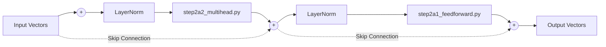

# Step 2a: The Transformer Block

The `step2a_block.py` file is the repeating factory floor of the GPT. Vectors enter this block, get refined, and leave. 

There are two major phases inside the block: **Communication** and **Computation**.

## The Block Architecture

### 1. Communication (Multi-Head Attention)
The first thing that happens is the vectors look at each other. The word " బ్యాంకు" (Bank) needs to look around the sentence to figure out if it means a "River Bank" or a "Money Bank". This happens inside `step2a2_multihead.py`.

### 2. Computation (FeedForward)
Once "Bank" realizes it is sitting next to "River", it needs time to process what that means. The FeedForward layer (`step2a1_feedforward.py`) allows every single token to think about its new context in total isolation. 

## The Crucial Helpers

### Layer Normalization (`LayerNorm`)
Notice how the data passes through `LayerNorm` before doing any heavy math. Normalization simply squashes the numbers so they aren't astronomically huge or microscopically small. This keeps the network stable during training.

### Residual Connections (`+`)
Notice the dotted lines skipping past the heavy math? These are **Residual Connections**. 
If a Transformer Block accidentally ruins a vector during computation, the original vector is simply added back on at the end `(+)`. This ensures the model never "forgets" what the word originally was!
