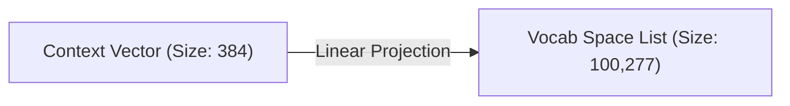
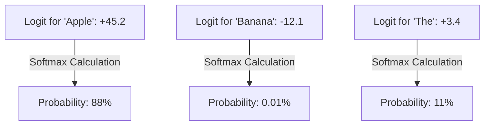

# Step 3: The Output Head

The `step3_output.py` file is the translator. It takes the deep, mathematical context vectors produced by the GPT brain and translates them back into human vocabulary probabilities.

## 1. The Language Modeling Head (`lm_head`)

When the vectors finally exit `step2_gpt.py`, they are just lists of 384 numbers. The model understands what they mean, but we don't. We need to map those 384 numbers against our entire vocabulary dictionary of 100,277 known Tiktoken words.

To do this, we pass the vector through a final `nn.Linear` projection.

## 2. Logits to Probabilities

The output of that `Linear` layer is a list of exactly 100,277 numbers. These numbers are called **Logits**. 

Logits are raw, unbounded numbers. The number for "Apple" might be `+45.2`, the number for "Banana" might be `-12.1`, and the number for "The" might be `+3.4`. 

We cannot make a decision based on arbitrary unscaled numbers. So, we squish the entire list of 100,277 Logits through a function called **Softmax**. 

Softmax forces the entire list of numbers to add up to exactly `1.0` (100%).

## 3. Sampling the Answer

Now that the logic board has given us a clean set of percentages, how do we pick the next word? 

We do *not* just pick the highest percentage! If we always picked the top choice (greedy decoding), the AI would sound incredibly robotic and repetitive.

Instead, we use `torch.multinomial()` to roll a mathematical weighted dice.
*   If "Apple" is 88%, the model will *usually* pick Apple.
*   If "The" is 11%, the model will occasionally pick The, giving it human-like variety and creativity (often called "Temperature").

Once the word is sampled, the integer ID is passed back through `step1_tokenizer.py`'s `decode()` function, and a human finally reads the word!
