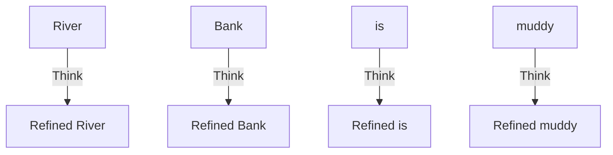
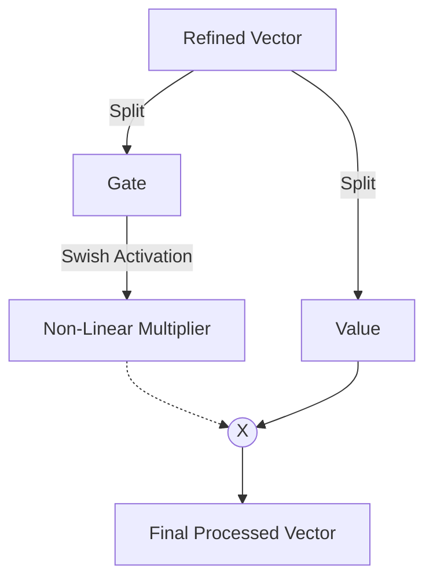

# Step 2a1: The FeedForward Layer

The `step2a1_feedforward.py` file is the pure computation organ of the Transformer. 

While the "Attention" layers allow tokens to talk to *other* tokens, the FeedForward layer physically isolates every single token and refuses to let them share information.

## The Computation Phase

Imagine the tokens have just finished talking to each other in the Attention layer. The word **" బ్యాంకు" (Bank)** just realized the word **"River"** is sitting next to it. 

"Bank" now has a huge realization: *"Oh! I am a watery bank, not a money bank!"* 

The FeedForward layer gives "Bank" time to think about this new realization in total isolation. 

*Notice how there are no arrows crossing between the words. The FeedForward layer acts independently on every single token.*

## How LLaMA Calculates: The SwiGLU Upgrade

Classic Transformers passed the data through a single wire and erased negative numbers (`ReLU`). 
The `model_llama` architecture uses a much more complex dual-path system called **SwiGLU**.

1. **The Dual Path:** The vector is linearly projected into two completely separate mathematical spaces: the **Gate** and the **Value**.
2. **The Swish (SiLU):** The Gate vector is passed through a curved activation function. Instead of blindly deleting negative numbers like ReLU, Swish curves them gently, preserving deep, complex relationships.
3. **The Multiplication:** The Activated Gate is physically multiplied against the Value. This allows the model to intelligently "turn off" or "turn on" different parts of the Value vector based on what context the Gate discovered!

*For the exact Sigmoid mathematical equations used to calculate Swish, reference `llama.md` in the root folder!*
