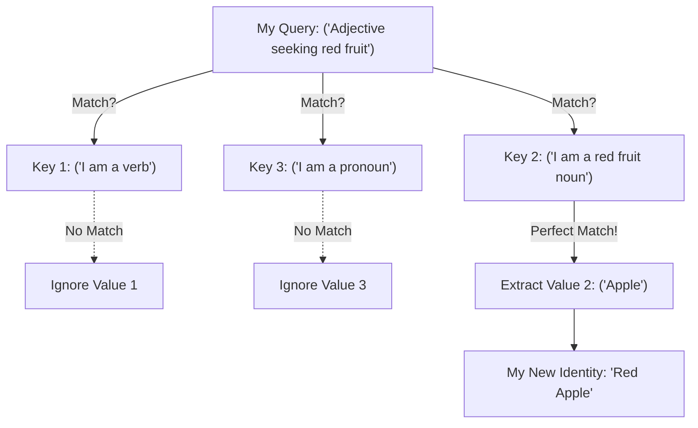
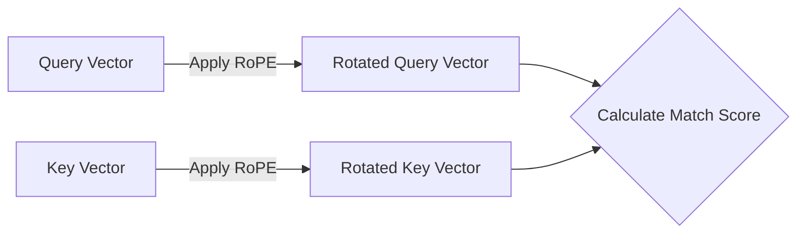

# Step 2a2a: The Single Attention Head

The `step2a2a_attention.py` file is the core communication organ. It is where tokens actually "look at" each other.

To understand Attention, you have to understand a concept borrowed from database retrieval: **Queries**, **Keys**, and **Values**.

## The Database Analogy

Imagine you go to a huge library (the sentence). 

*   You are holding a piece of paper describing what you want: *"I am an Adjective, I need a red fruit noun."* This is your **Query (`Q`)**.
*   Every book on the shelf has a sticker on the spine describing what it is: *"I am a plural Noun, my root word is Apple."* This is the book's **Key (`K`)**.

You walk down the aisle and compare your `Query` paper to every single book's `Key` sticker. 
*   If your Query doesn't match the Key (e.g., the sticker says `"I am a verb"`), you ignore the book.
*   If your Query matches the Key perfectly (e.g., the sticker says `"I am a red fruit noun"`), you take the book off the shelf and read its **Value (`V`)** (the actual story inside).

### Visualizing Attention

## The LLaMA Upgrade: Rotary Position Embeddings (RoPE)

In classic Transformers, tokens memorized their absolute position (e.g., "I am Word #4").

LLaMA abandons this. In `model_llama`, we dynamically rotate the $Q$ and $K$ vectors right before they attempt to match with each other. The amount of rotation is determined by how far apart the two words are in the sentence. 

If my $Q$ is at position 10, and your $K$ is at position 9, your vector is rotated just slightly. But if your $K$ is at position 2, it is rotated massively. This allows the model to inherently understand **Relative Distance** just by matching the angular alignments of the vectors!

*For the exact trigonometric mathematical equations used to rotate these matrices, reference `llama.md` in the root folder!*
