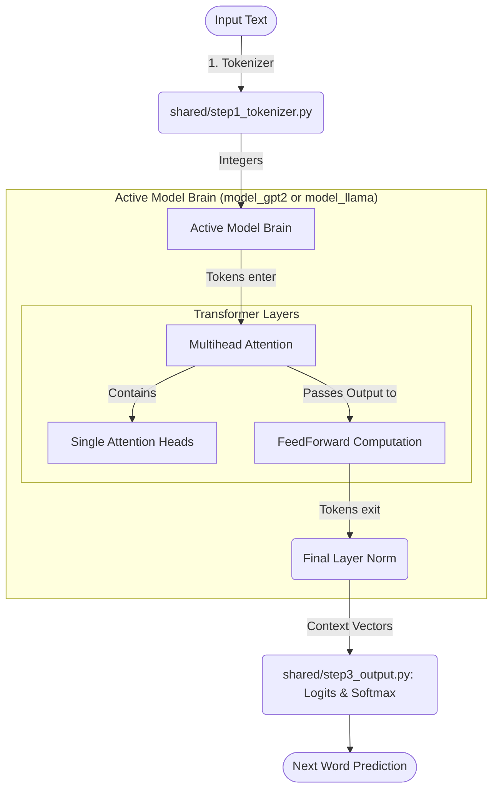
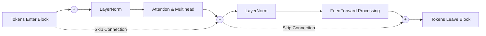
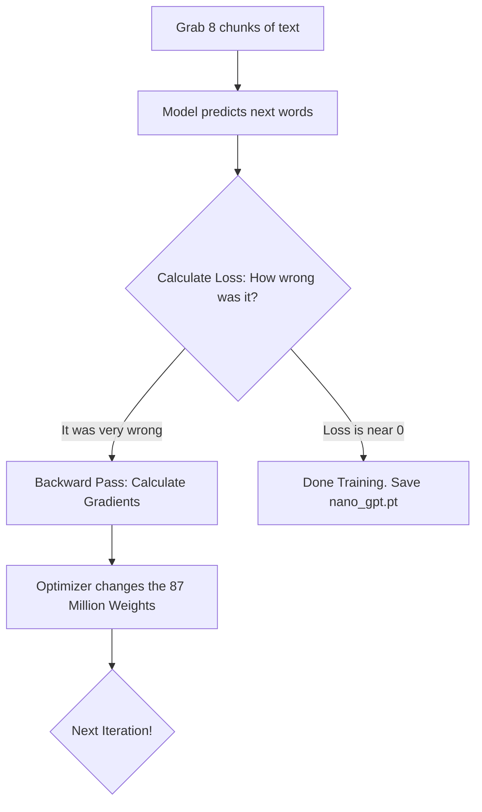

# Nano-GPT Architecture Walkthrough

This document visually breaks down how the Generative Pre-trained Transformer predicts the next word, avoiding complex mathematics in favor of logic flow. 

## 1. The High-Level Flow (How a word travels)

When you run `generate.py` and give it a context, here is exactly how that text becomes a new word prediction:



## 2. Inside the Transformer Block

The true magic happens inside the Transformer Block layer. Each Block is a repeated factory floor. The tokens enter the floor, perform two separate operations, and leave.


* **Self-Attention** is where the tokens *communicate* with each other to gather context.
* **FeedForward** is where each token takes exactly what it just learned and *computes* it individually before passing it to the next block.
* **The `(+)` signs** represent "Residual Connections." These are crucial for keeping the model stable. We add the raw input back onto the processed output so the original meaning is never lost!

## 3. How Self-Attention Thinks (Pseudo-Code)

If we examine the Attention Head, the core math relies on three concepts: `Query (Q)`, `Key (K)`, and `Value (V)`. Here is what that actually means:

```python
def explain_self_attention(sentence):
    """
    Every token in the sentence plays three roles simultaneously:
    """
    for token in sentence:
        # ROLE 1: The Query (What am I looking for?)
        token.query = "I am an adjective, I need to look for the noun I describe."
        
        # ROLE 2: The Key (Who am I?)
        token.key = "I am a noun, my name is 'Apple'."
        
        # ROLE 3: The Value (If you find me, what do I actually mean?)
        token.value = [0.12, 0.44, -0.9] # The actual mathematical meaning

    for token in sentence:
        # 1. Match my Query against every past token's Key
        scores = get_match_scores(my_query=token.query, all_past_keys=past.keys)
        
        # 2. We don't want to look at future tokens (that's cheating!)
        scores = apply_autoregressive_mask(scores) # Hides the future
        
        # 3. Grab the Values of the tokens that matched me strongly
        my_new_context = aggregate(scores * past.values)
        
    return my_new_context
```

## 4. The Training Loop (How it learns)

When you run `train_gpt.py`, it loops over your dataset repeatedly. 


